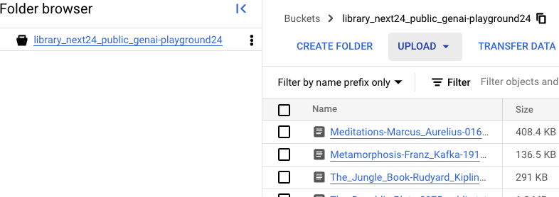
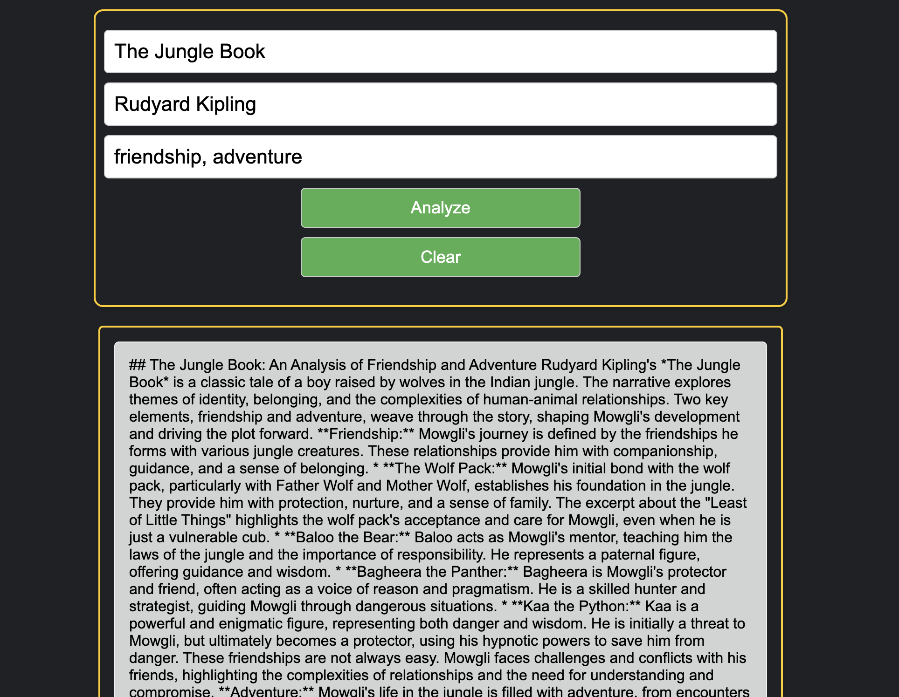

0. What's the best way to show alternatively any of the following 5 pages?
    - different URLs?
    - Interesting here is how to switch between the screens elegantly, reset the screens

1. Upload a text file to Google Cloud Storage

    Command to upload to Storage URL is in the format:
    gsutil cp images/<image-name>.jpeg gs://<bucket name>/<file-name>

    ex.: gs://library_next24_public_genai-playground24/The_Jungle_Book-Rudyard_Kipling-1894-public.txt

    Currently it is uploaded using the GCP console
    

Questions
    - what's the best way of doing it
    - selecting the file from local env and sending it from UI to an "endpoint" would allow for the file to uploaded by the service at the "endpoint". Is that the best way?

2. Upload an image to a Storage Bucket
Questions: same as above

3. Book analysis by keywords
    The use cases would be:
    - collect 3 fields, say author, book, keywords and invoke Endpoint where the service has functionality built in for RAG 
    - response displayed on the UI
    - currently it is a simple HTML page

4. Sentiment analysis (or text classification)
    - collect 3 fields, say author, book
    - 2 buttons (Sentiment Analysis, Retrieve a summary - RAG + grounded with websearch)
    - display the result

- collect 3-4 fields, invoke an Endpoint, LLM performs RAG and the response comes back
- upload a file from the local machine, or Git repo, or anything, to a Google Cloud Storage bucket (text, mp3, mp4) - right now it works by simply using the GCP console to upload

